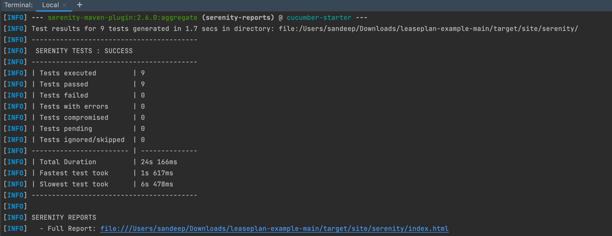
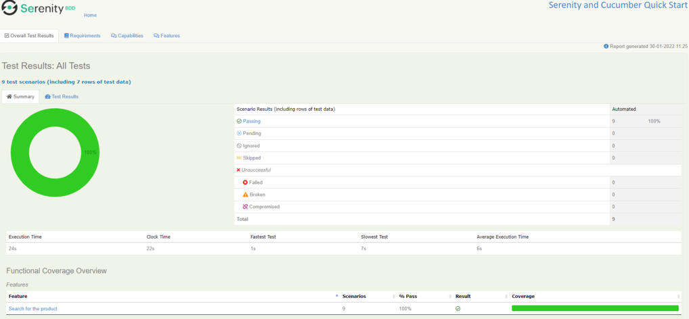
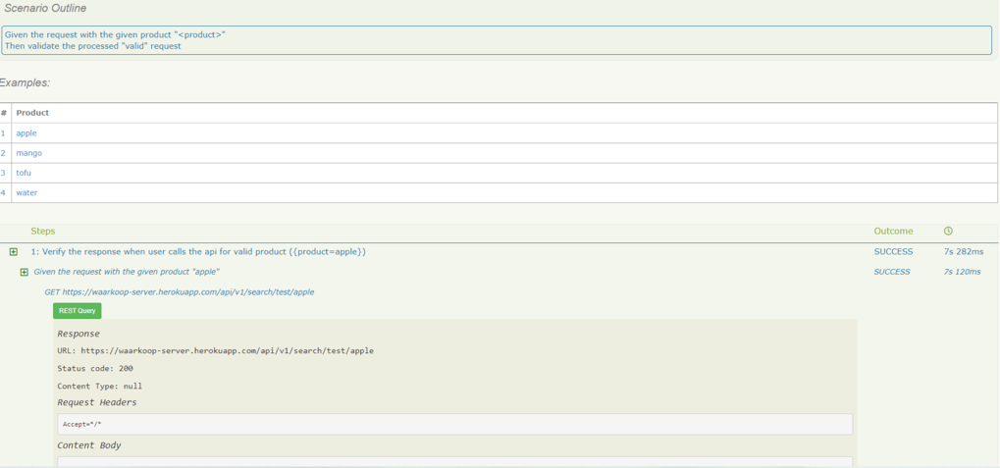

# LeasePlan Automation Framework(LAF) #

This is a light weighted BDD framework built using java and serenity to perform API automation.
Serenity BDD is a library that makes it easier to write high quality automated acceptance tests, and it encourages good test automation design.

**Libraries used:**
1. Serenity Cucumber
2. Serenity Rest Assured

### Prerequisites

What you need to install before importing the project.
`
JAVA 8 or later and A Build Tool - Maven
`

### Getting Started ###

Open your favorite IDE and take a git pull of the project


### The project directory structure
The project has build scripts for Maven and follows the standard directory structure used in most Serenity projects:
```Gherkin
src
  + main
  + test
    + java                        Test runners and supporting code
      +starter
        +stepdefinitions          All the step definitions for written feature test steps
        +TestRunner
    + resources
      + features.search                  Feature files 
                    
        +post_product.feature            All the Cucumber test cases
```

### Executing the tests
To run the project, you can either just run the `TestRunner.java` test runner class, or run `mvn verify` from the command line.
Current poject is having automated feature of API.

The test results will be recorded in the `target/site/serenity` directory.


### Generating the reports
Since the Serenity reports contain aggregate information about all of the tests, they are not generated after each individual test (as this would be extremenly inefficient). Rather, The Full Serenity reports are generated by the `serenity-maven-plugin`. You can trigger this by running `mvn serenity:aggregate` from the command line or from your IDE.

They reports are also integrated into the Maven build process: the following code in the `pom.xml` file causes the reports to be generated automatically once all the tests have completed when you run `mvn verify`

```
             <plugin>
                <groupId>net.serenity-bdd.maven.plugins</groupId>
                <artifactId>serenity-maven-plugin</artifactId>
                <version>${serenity.maven.version}</version>
                <configuration>
                    <tags>${tags}</tags>
                </configuration>
                <executions>
                    <execution>
                        <id>serenity-reports</id>
                        <phase>post-integration-test</phase>
                        <goals>
                            <goal>aggregate</goal>
                        </goals>
                    </execution>
                </executions>
            </plugin>
```
Some screenshots after execution of test steps



### Resources

For more information about Serenity BDD, you can read the [**Serenity BDD Book**](https://serenity-bdd.github.io/theserenitybook/latest/index.html), the official online Serenity documentation source. Other sources include:
* **[Serenity BDD Book](https://serenity-bdd.github.io/theserenitybook/latest/index.html)** - tips and tricks about Serenity BDD
* **[Sample Blog](https://blog.j-labs.pl/testing-rest-api-with-serenity-and-rest-assured)** - Some examples feature and stepdefinition files
* **[Rest Assured Library](http://rest-assured.io/)**